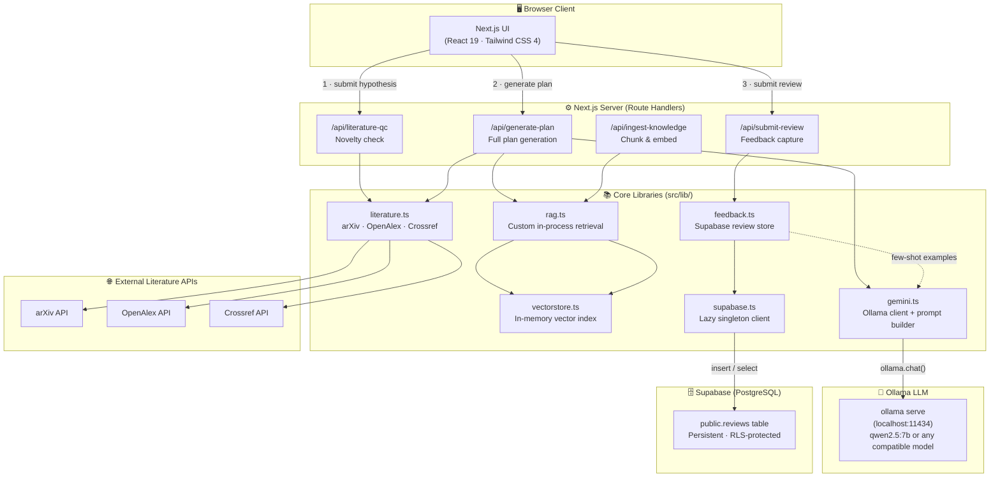
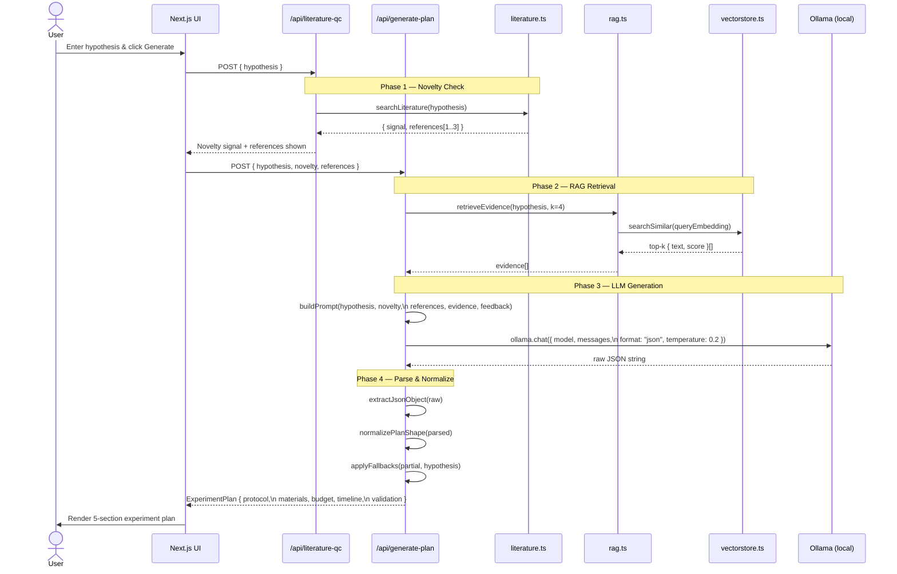
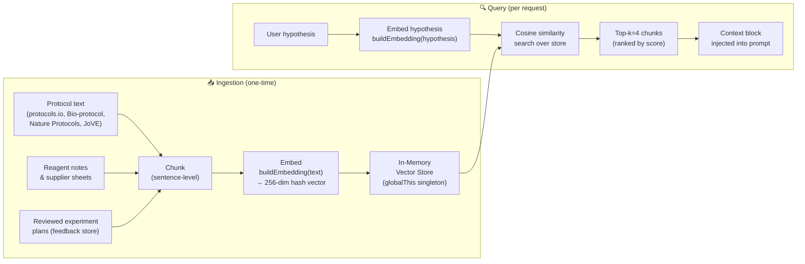
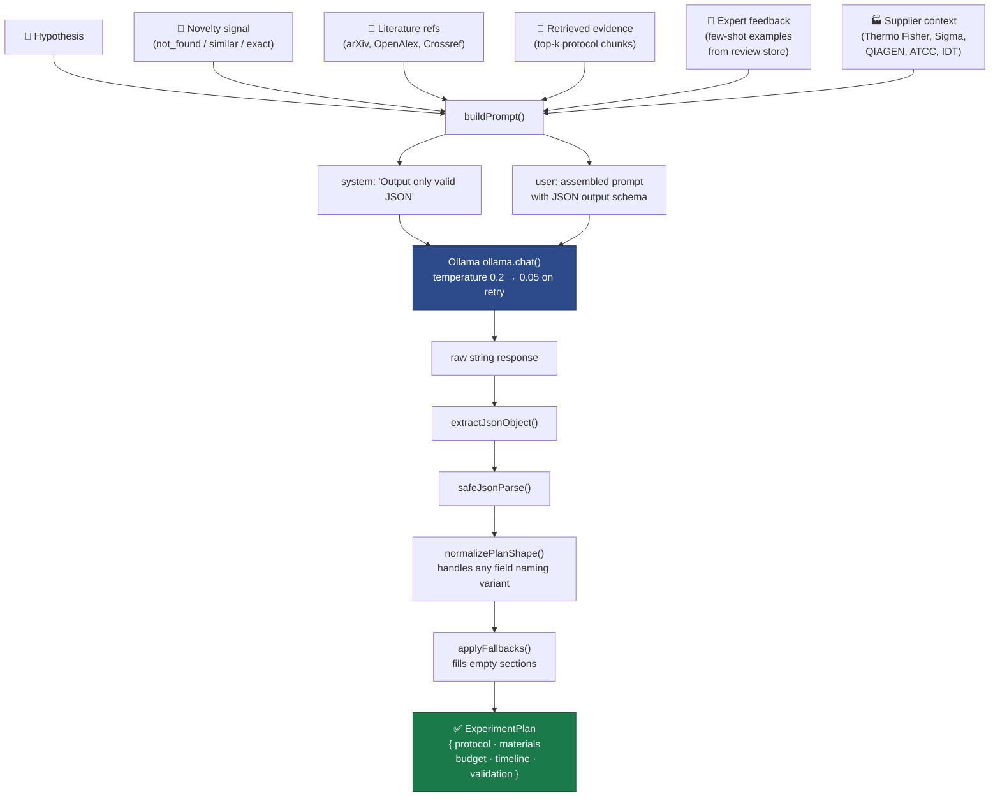
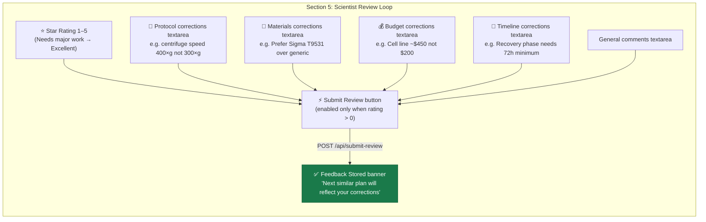
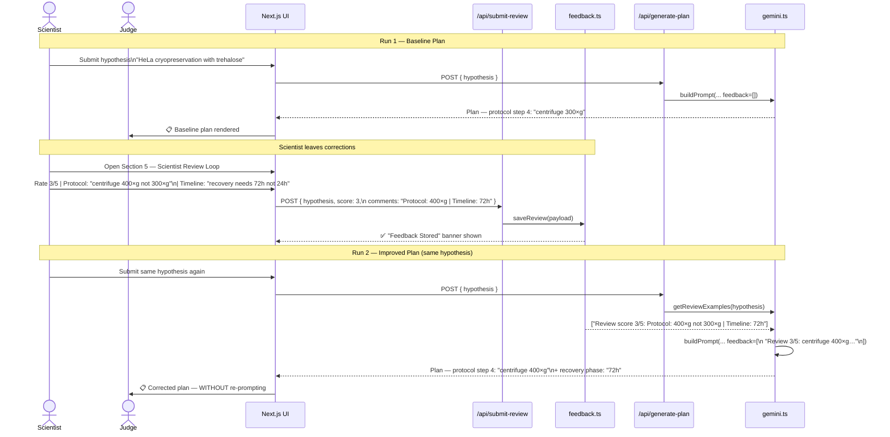
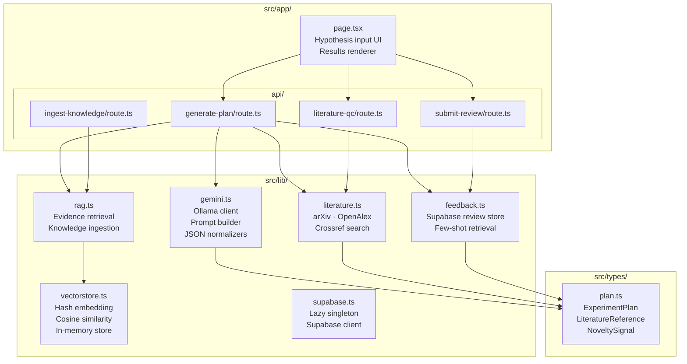

# AI Scientist — System Architecture

> End-to-end architecture for a hypothesis-to-experiment-plan AI platform.
> Built on Next.js, Ollama (local LLM), custom in-process RAG, and live literature APIs.

---

## 1. High-Level System Overview



---

## 2. Request Lifecycle — Full Plan Generation

The core user journey, step by step:



---

## 3. RAG Pipeline — Retrieval-Augmented Generation



**Embedding approach:** Token-hash bag-of-words in a 256-dimensional float vector, normalized to unit length for cosine similarity. Zero external API calls — runs entirely in-process. Upgradeable to sentence-transformers or OpenAI embeddings without changing the interface.

---

## 4. LLM Prompt Architecture



---

## 5. ⭐ Stretch Goal — Scientist Review Loop (Closing the Learning Loop)

> *"The demo that wins this stretch goal is one where a judge can watch the system generate a plan, a scientist leave structured corrections, and the next plan for a similar experiment visibly reflect those corrections — without being explicitly re-prompted."*

### 5a. Review UI — What the User Sees



---

### 5b. Full Review + Regeneration Flow (The Judge Demo)



---

### 5c. Feedback Retrieval Mechanism

```mermaid
flowchart LR
    H["New hypothesis\n'HeLa cryopreservation'"]
    H --> TOK["Tokenize hypothesis\n['hela', 'cryo', 'trehalose', ...] (>3 chars)"]
    TOK --> SQ["Supabase query\nSELECT last 50 reviews\nORDER BY created_at DESC"]
    SQ --> FILTER["JS keyword filter\nreviewTokens.some(t => queryTokens.has(t))"]
    FILTER --> SLICE[".slice(0, 3) — up to 3 matching reviews"]
    SLICE --> FORMAT["Format as few-shot blocks:\n'Review score N/5: [comments]'"]
    FORMAT --> INJ["Injected into buildPrompt()\n=== SCIENTIST FEEDBACK ==="]
    INJ --> OL["Ollama generates plan\nwith corrections as context"]

    style OL fill:#2d4a8a,color:#fff,stroke:#1a3060
    style INJ fill:#7a4a1a,color:#fff,stroke:#5c3010
    style SQ fill:#1a4a6a,color:#fff,stroke:#0d3050
```



**Key implementation facts:**
- Supabase query pulls the last `poolSize=50` reviews ordered by recency — no full-table scan
- Token-matching runs in JS using word overlap (no embedding cost) — fast and domain-appropriate
- `limit=3` cap keeps the prompt from ballooning on highly-reviewed experiment types
- Section corrections are merged into one string: `"Protocol: X | Materials: Y | Timeline: Z"`
- The model sees corrections as **explicit named context** before generating — it directly incorporates them
- No fine-tuning, no retraining, no re-prompting — the learning loop is fully automatic


---

## 6. File & Module Map



---

## 7. Tech Stack — Deep Dive

### 7.1 Frontend

| Technology | Version | Role |
|---|---|---|
| **Next.js** | 16.2.4 | Full-stack React framework. App Router for routing, Route Handlers for API. |
| **React** | 19.2.4 | Component model. Used for hypothesis form, literature QC panel, 5-section plan renderer, review interface. |
| **TypeScript** | ^5 | Strict typing across all lib modules and API contracts. |
| **Tailwind CSS** | ^4 | Utility-first styling. Dark theme, glassmorphism cards, responsive layout. |

**Design highlights:**
- Single-page hypothesis input with real-time validation
- Animated loading states during LLM generation (~30–60s)
- Five collapsible sections: Protocol · Materials · Budget · Timeline · Validation
- Literature QC badge showing novelty signal + clickable reference cards
- Scientist Review panel with per-section rating and annotation fields

---

### 7.2 Backend (Next.js Route Handlers)

All server logic runs as edge-compatible Route Handlers — no separate Express/Fastify server.

| Route | Method | Purpose |
|---|---|---|
| `/api/literature-qc` | `POST` | Fan-out to arXiv, OpenAlex, Crossref. Returns novelty signal + top-3 refs. |
| `/api/generate-plan` | `POST` | Orchestrates RAG retrieval → prompt assembly → Ollama call → plan normalization. |
| `/api/submit-review` | `POST` | Stores structured expert feedback in Supabase PostgreSQL (`public.reviews`). |
| `/api/ingest-knowledge` | `POST` | Accepts text chunks, embeds them, upserts into vector store. |

---

### 7.3 AI Generation — Ollama

| Attribute | Detail |
|---|---|
| **Library** | `ollama` npm (`^0.6.3`) |
| **Default model** | `qwen2.5:7b` (configurable via `OLLAMA_MODEL`) |
| **Server** | Local: `http://localhost:11434` (configurable via `OLLAMA_BASE_URL`) |
| **Auth** | None for local; `Authorization: Bearer <key>` header for Ollama Cloud |
| **Call mode** | `ollama.chat()`, non-streaming, `format: "json"` |
| **Temperature** | `0.2` (first attempt) → `0.05` (retry with strict prompt) |
| **Retry logic** | 2 attempts: relaxed prompt → strict prompt. Auth errors surface immediately. |

**Why Ollama?**
- Zero API cost — runs entirely on local hardware
- Full data privacy — no hypothesis leaves the machine
- Model-agnostic — swap `qwen2.5:7b` for `llama3.1:8b`, `mistral:7b`, or any GGUF model without code changes
- JSON mode (`format: "json"`) improves structured output reliability

**Supported local models (tested):**
- `qwen2.5:7b` — recommended (fast, good JSON discipline)
- `qwen2.5:72b` — higher quality, requires ~48GB VRAM
- `llama3.1:8b` — good general purpose
- `mistral:7b` — fast, lighter VRAM

---

### 7.4 RAG Pipeline

| Component | Implementation |
|---|---|
| **Orchestrator** | `src/lib/rag.ts` — `retrieveEvidence(query, k=4)`, `ingestKnowledgeChunks(chunks)` |
| **Embedding** | `buildEmbedding()` — 256-dim hash bag-of-words, L2-normalized. Pure TypeScript, zero dependencies. |
| **Similarity** | Cosine similarity over all stored vectors, sorted descending, slice top-k. |
| **Store** | `globalThis.__aiScientistVectorStore` — survives hot-reload, resets on cold server restart. |
| **Seeding** | 4 baseline scientific-method guidelines auto-seeded on first use. |
| **Upgrade path** | Replace `vectorstore.ts` with Pinecone / Weaviate / pgvector adapter. The `rag.ts` interface is unchanged. |

---

### 7.5 Literature Search

| API | Base URL | What it returns |
|---|---|---|
| **arXiv** | `export.arxiv.org/api/query` | Preprint papers, full text search, Atom XML feed |
| **OpenAlex** | `api.openalex.org` | Open scholarly metadata, DOI, citation counts |
| **Crossref** | `api.crossref.org` | Peer-reviewed DOIs, journal metadata, publisher info |

**Novelty classification logic (`literature.ts`):**
- `exact` — title similarity score > 0.85, same domain
- `similar` — 1–3 references found with moderate relevance
- `not_found` — no match above threshold

All three APIs are queried in parallel with `Promise.allSettled()`. Individual API failures are silently skipped — the endpoint never errors on a single bad API.

---

### 7.6 Feedback Store

| Attribute | Detail |
|---|---|
| **Implementation** | `src/lib/feedback.ts` — **Supabase-backed** (`@supabase/supabase-js ^2`) |
| **Database** | Supabase PostgreSQL — `public.reviews` table with RLS policies |
| **Stored fields** | `hypothesis` (TEXT), `score` (SMALLINT 1–5), `comments` (TEXT), `created_at` (TIMESTAMPTZ) |
| **Save** | `saveReview(payload)` — `insert` into `reviews`, returns the inserted row |
| **Retrieval** | `getReviewExamples(hypothesis, limit=3, poolSize=50)` — fetches the last 50 reviews, filters in-JS by keyword token overlap, returns up to 3 as few-shot strings |
| **Injection point** | `buildPrompt()` in `gemini.ts` — section: `SCIENTIST FEEDBACK (from prior similar experiments)` |
| **Persistence** | Reviews survive server restarts, `npm run dev` restarts, and Vercel cold starts |
| **Setup** | Run `supabase_setup.sql` in Supabase SQL Editor; add `NEXT_PUBLIC_SUPABASE_URL` + `NEXT_PUBLIC_SUPABASE_ANON_KEY` to `.env.local` |

---

## 8. Data Flow Summary

```
User → [Hypothesis text]
       ↓
   /api/literature-qc
       ↓
   arXiv + OpenAlex + Crossref  →  novelty signal + 1–3 refs
       ↓
   /api/generate-plan
       ↓
   vectorstore cosine search  →  top-4 evidence chunks
       ↓
    Supabase query (last 50 reviews) → JS keyword filter → 0–3 few-shot expert corrections
       ↓
   buildPrompt()  →  [system | user] message pair with full JSON schema
       ↓
   Ollama ollama.chat()  →  raw JSON string
       ↓
   extractJsonObject() → safeJsonParse() → normalizePlanShape() → applyFallbacks()
       ↓
   ExperimentPlan { protocol · materials · budget · timeline · validation }
       ↓
   UI renders 5-section plan  →  Scientist reviews  →  feedback stored
       ↓
   (next similar hypothesis benefits from the stored correction)
```

---

## 9. Upgrade Roadmap

| Component | Current | Upgrade Option |
|---|---|---|
| LLM | Ollama local (self-hosted) | Remote Ollama server, OpenAI, Anthropic, Groq |
| Embedding | 256-dim hash vector (in-process) | `text-embedding-3-small`, `nomic-embed-text` via Ollama |
| Vector store | In-memory `globalThis` singleton | Pinecone, Weaviate, Qdrant, pgvector (Supabase) |
| Feedback store | **Supabase PostgreSQL** (persistent) | Already production-ready; add auth for multi-user isolation |
| Literature QC | arXiv + OpenAlex + Crossref | PubMed, Semantic Scholar, Scopus, IEEE Xplore |
| Deployment | Local `npm run dev` | Vercel (frontend + API) + remote Ollama server |

---

*Built for Fulcrum Science × MIT Club Challenge #04 · Team HN-9663*

> **Note on `lib/gemini.ts` filename:** Named `gemini.ts` for historical reasons (an early prototype targeted the Gemini API). The actual implementation uses the `ollama` npm client throughout — the filename is a legacy artifact; the code is entirely Ollama-based.
